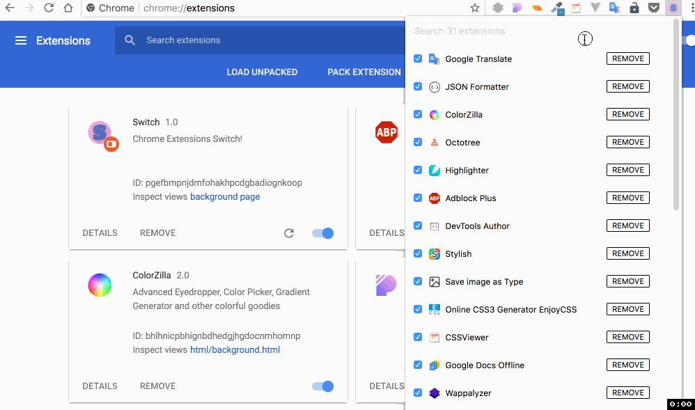

# Switch

Manage chrome extensions from the toolbar

## Usage

1. Download the CRX file (Switch.crx) or ZIP file to your computer.
2. Go to chrome://extensions/ and check the box for Developer mode in the top right.
3. Drag CRX file in or click the Load unpacked extension button to select the unzipped folder.

## Gif

